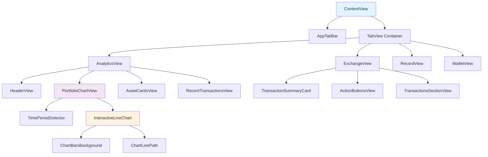
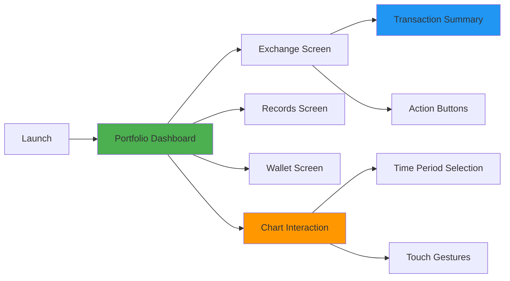

# 📱 CryptoPortfolio - iOS App Assignment

A pixel-perfect iOS application for cryptocurrency portfolio management and exchange operations, built with SwiftUI. This app features interactive charts, real-time portfolio tracking, and a modern glassmorphism design.


## 🎯 Assignment Overview

This project was developed as part of a technical assignment to recreate specific UI screens for a crypto portfolio and exchange app with focus on:

- **Pixel-perfect design implementation**
- **Smooth user interactions and animations**
- **Component-based architecture**
- **Modern SwiftUI practices**

## ✨ Features Implemented

### 🏠 Portfolio Dashboard Screen ✅

- ✅ **Interactive Portfolio Chart** with animated line graph and background bars
- ✅ **Portfolio Value Header** with currency toggle (INR ↔ Bitcoin)
- ✅ **Time Period Selector** (1h, 8h, 1d, 1w, 1m, 6m, 1y)
- ✅ **Animated Chart Transitions** with smooth data updates
- ✅ **Asset Cards** for BTC, ETH with price and delta information
- ✅ **Recent Transactions** section with transaction history

### 💱 Exchange Screen ✅

- ✅ **Portfolio Summary Card** with large value display
- ✅ **Action Button Group** (Send/Receive/Exchange)
- ✅ **Transaction List** with date, type, and token information
- ✅ **Swap Interface** (Basic implementation)

### 🧭 Navigation ✅

- ✅ **Custom Tab Bar** with glassmorphism effect
- ✅ **Tab Highlighting** and smooth transitions
- ✅ **Multi-screen Navigation** between Analytics, Exchange, Records, and Wallet

### 🎨 Design & UX ✅

- ✅ **Dark Mode Implementation** (Primary focus as requested)
- ✅ **Custom Color Scheme** with theme management
- ✅ **Smooth Animations** throughout the app
- ✅ **Interactive Touch Gestures** on charts
- ✅ **Mock Data Integration** for realistic portfolio simulation

## 🏗️ App Architecture



## 📱 Screen Flow



## 🛠️ Technical Implementation

### Core Components

#### 📊 Interactive Chart System

```swift
InteractiveLineChart
├── ChartBarsBackground    // Animated background bars
├── ChartLinePath         // Smooth line rendering
├── SelectionIndicator    // Touch interaction feedback
└── TimePeriodSelector    // Period switching logic
```

#### 🎨 Design System

```swift
ColorTheme
├── Blue (#2196F3)
├── LightBlue (#03DAC6)
├── Gray (#424242)
└── Dark (Custom)
```

#### 📐 Architecture Pattern

- **MVVM (Model-View-ViewModel)**
- **ObservableObject** for state management
- **@StateObject** and **@State** for UI updates
- **Component-based** reusable UI elements

## 🚀 Getting Started

### Prerequisites

- **Xcode 14.0+**
- **iOS 15.0+**
- **Swift 5.7+**

### Installation Steps

1. **Clone the Repository**

   ```bash
   git clone https://github.com/yourusername/CryptoPortfolio.git
   cd CryptoPortfolio
   ```

2. **Open in Xcode**

   ```bash
   open CryptoPortfolio.xcodeproj
   ```

3. **Select Target Device**

   - Choose iPhone 13 Pro or later in the simulator
   - Ensure iOS 15.0+ deployment target

4. **Build and Run**
   - Press `Cmd + R` or click the Run button
   - App will launch in dark mode by default

### 📱 Recommended Test Devices

- iPhone 13 Pro (Primary)
- iPhone 14 Pro
- iPhone 15 Pro

## 🎯 Key Features Showcase

### 📈 Interactive Portfolio Chart

- **Animated Line Graph**: Smooth bezier curves with gradient colors
- **Background Bars**: Width-optimized bars with proper spacing
- **Touch Interaction**: Tap and drag to explore data points
- **Time Period Selection**: 7 different time ranges with smooth transitions
- **Currency Toggle**: INR ↔ Bitcoin conversion with real-time updates

### 🎨 Visual Design Elements

- **Glassmorphism Tab Bar**: Semi-transparent with backdrop blur
- **Gradient Backgrounds**: Custom color schemes for depth
- **Rounded Corners**: Consistent 16-24pt radius throughout
- **Shadow Effects**: Subtle elevation for card components
- **Animation Timing**: Carefully tuned for 60fps performance

### 📊 Data Management

- **Mock Data Generation**: Realistic portfolio trends with volatility
- **Currency Conversion**: Multi-currency support (INR, USD, BTC)
- **State Management**: Reactive UI updates with ObservableObject
- **Performance Optimization**: Efficient rendering with animation progress tracking

## 🎨 Design Specifications

### Color Palette

| Color           | Hex                | Usage                       |
| --------------- | ------------------ | --------------------------- |
| Primary Blue    | `#2196F3`          | Highlights, Selected States |
| Light Blue      | `#03DAC6`          | Accents, Gradients          |
| Dark Background | `rgba(25,25,25,1)` | Main Background             |
| Gray            | `#424242`          | Secondary Elements          |

### Typography

- **Headers**: System Font, 32-36pt, Semibold
- **Body**: System Font, 14-16pt, Medium
- **Captions**: System Font, 12pt, Regular

### Spacing & Layout

- **Margins**: 16-20pt horizontal, 20-30pt vertical
- **Card Padding**: 16-24pt internal
- **Corner Radius**: 16pt (Cards), 24pt (Main containers)

## 🔄 Animation Details

### Chart Animations

- **Line Drawing**: 1.5s ease-in-out curve drawing
- **Bar Entrance**: Staggered 0.8s with 0.02s delays
- **Selection**: 0.2s smooth highlighting
- **Period Changes**: 1.0s cross-fade transitions

### UI Transitions

- **Tab Switching**: 0.3s ease-in-out
- **Currency Toggle**: 0.3s smooth state change
- **Touch Feedback**: 0.1s immediate response

## 📝 Project Structure

```
CryptoPortfolio/
├── Models/
│   ├── Currency.swift          # Currency type definitions
│   ├── PortfolioChart.swift    # Chart data models
│   └── Transaction.swift       # Transaction data models
├── Views/
│   ├── Analytics/
│   │   ├── AnalyticsView.swift
│   │   └── Components/
│   │       ├── HeaderView.swift
│   │       ├── PortfolioChartView.swift
│   │       ├── InteractiveLineChart.swift
│   │       ├── TimePeriodSelector.swift
│   │       ├── AssetCardsView.swift
│   │       └── RecentTransactionsView.swift
│   ├── Exchange/
│   │   ├── ExchangeView.swift
│   │   └── Components/
│   ├── Shared/
│   │   ├── AppTabBar.swift
│   │   ├── AppHeader.swift
│   │   └── CustomRoundCard.swift
│   └── ...
├── Extensions/
│   └── Color.swift            # Theme management
└── Assets.xcassets/           # Images and colors
```

## ✅ Assignment Requirements Checklist

### Core Requirements

- [x] **SwiftUI Implementation** - Modern declarative UI framework
- [x] **Pixel-Perfect Design** - Matches reference designs closely
- [x] **Component-Based Structure** - Reusable, modular components
- [x] **MVVM Architecture** - Clean separation of concerns
- [x] **Mock Data Integration** - Realistic portfolio simulation
- [x] **Dark Mode Support** - Primary implementation as requested

### Screen Implementation

- [x] **Portfolio Dashboard** - Complete with interactive chart
- [x] **Exchange Screen** - Transaction summary and action buttons
- [x] **Navigation Bar** - Custom tab bar with glassmorphism
- [x] **Multi-Screen Navigation** - Functional screen switching

### Bonus Features

- [x] **Animated Graph Transitions** - Smooth chart animations
- [x] **Glassmorphism Effect** - Tab bar backdrop blur
- [x] **Interactive Touch Gestures** - Chart touch interaction
- [x] **Responsive Design** - iPhone 13+ optimization

## 🎥 Demo Features

### Interactive Chart Demo

1. **Launch App** → Portfolio screen loads with animated chart
2. **Touch Chart** → Tap anywhere to select data points
3. **Change Period** → Tap time period buttons (1h, 8h, etc.)
4. **Currency Toggle** → Switch between INR and Bitcoin
5. **Smooth Animations** → All transitions are fluid and responsive

### Navigation Demo

1. **Tab Bar** → Tap tabs to switch between screens
2. **Glassmorphism** → Notice the semi-transparent blur effect
3. **Screen Transitions** → Smooth page-style navigation

## 🔧 Known Limitations & Future Improvements

### Current Limitations

- **Light Mode**: Dark mode is prioritized (as requested)
- **Backend Integration**: Uses mock data only
- **Additional Screens**: Some secondary screens are placeholders
- **Haptic Feedback**: Not yet implemented

### Potential Improvements

- Full light mode implementation
- Real API integration
- Additional chart types (candlestick, volume)
- Push notifications for price alerts
- Biometric authentication
- Offline data caching

## 🧪 Testing Guidelines

### Manual Testing Checklist

- [ ] Launch app in simulator
- [ ] Verify chart loads with animation
- [ ] Test touch interactions on chart
- [ ] Switch between time periods
- [ ] Toggle currency options
- [ ] Navigate between all tabs
- [ ] Verify glassmorphism on tab bar
- [ ] Test on different device sizes

### Performance Considerations

- **60fps animations** maintained throughout
- **Memory efficient** chart rendering
- **Smooth scrolling** in transaction lists
- **Responsive touch** feedback

## 📧 Submission Details

**Assignment Completed For**: Skycloud Ventures  
**Submission Email**: dj@skycladventures.com  
**Developer**: Shishir Rijal  
**Completion Date**: August 15, 2025

## 📄 License

This project is created for assignment purposes. All design specifications and requirements are provided by Skycloud Ventures.

---

_Built with ❤️ using SwiftUI and modern iOS development practices_
