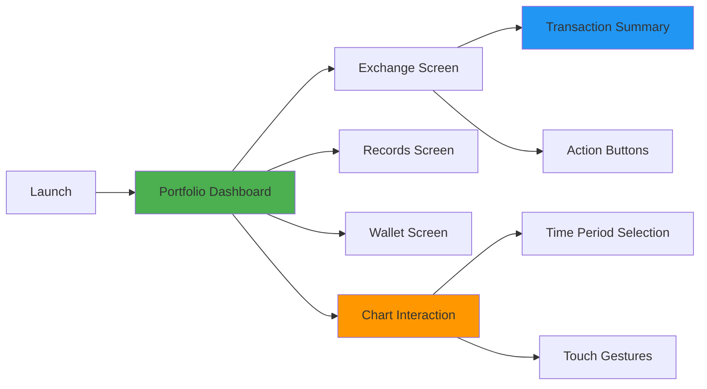

# 📱 CryptoPortfolio - iOS App Assignment

A pixel-perfect iOS application for cryptocurrency portfolio management and exchange operations, built with SwiftUI. This app features interactive charts, real-time portfolio tracking, and a modern glassmorphism design.


## 🎯 Assignment Overview

This project was developed as part of a technical assignment to recreate specific UI screens for a crypto portfolio and exchange app with focus on:

- **Pixel-perfect design implementation**
- **Smooth user interactions and animations**
- **Component-based architecture**
- **Modern SwiftUI practices**
  

## 📱 Screen Flow



## 🛠️ Technical Implementation

### Core Components

- **MVVM (Model-View-ViewModel)**
- **ObservableObject** for state management
- **@StateObject** and **@State** for UI updates
- **Component-based** reusable UI elements

## 🚀 Getting Started

### Prerequisites

- **Xcode 14.0+**
- **iOS 15.0+**
- **Swift 5.7+**

### Installation Steps

1. **Clone the Repository**

   ```bash
   git clone https://github.com/ShishirRijal/CryptoPortfolio.git
   cd CryptoPortfolio
   ```

2. **Open in Xcode**

   ```bash
   open CryptoPortfolio.xcodeproj
   ```

3. **Select Target Device**

   - Choose iPhone 13 Pro or later in the simulator
   - Ensure iOS 15.0+ deployment target

4. **Build and Run**
   - Press `Cmd + R` or click the Run button
   - App will launch in dark mode by default

### 📱 Recommended Test Devices

- iPhone 13 Pro (Primary)
- iPhone 14 Pro
- iPhone 15 Pro

## 🎯 Key Features Showcase

### 📈 Interactive Portfolio Chart

- **Animated Line Graph**: Smooth bezier curves with gradient colors
- **Background Bars**: Width-optimized bars with proper spacing
- **Touch Interaction**: Tap and drag to explore data points
- **Time Period Selection**: 7 different time ranges with smooth transitions
- **Currency Toggle**: INR ↔ Bitcoin conversion with real-time updates

### 🎨 Visual Design Elements

- **Glassmorphism Tab Bar**: Semi-transparent with backdrop blur
- **Gradient Backgrounds**: Custom color schemes for depth
- **Rounded Corners**: Consistent 16-24pt radius throughout
- **Shadow Effects**: Subtle elevation for card components
- **Animation Timing**: Carefully tuned for 60fps performance

### 📊 Data Management

- **Mock Data Generation**: Realistic portfolio trends with volatility
- **Currency Conversion**: Multi-currency support (INR, USD, BTC)
- **State Management**: Reactive UI updates with ObservableObject
- **Performance Optimization**: Efficient rendering with animation progress tracking
   
 
---

_Built with ❤️ by Shishir Rijal using SwiftUI_
